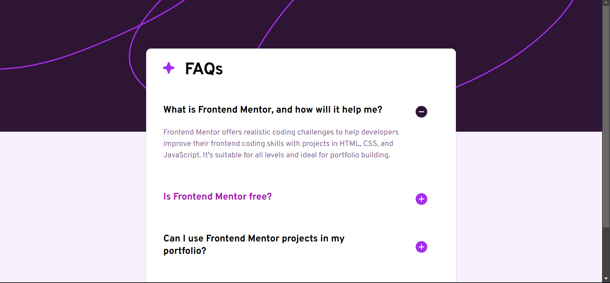

# Frontend Mentor - FAQ accordion solution

This is a solution to the [FAQ accordion challenge on Frontend Mentor](https://www.frontendmentor.io/challenges/faq-accordion-wyfFdeBwBz). Frontend Mentor challenges help you improve your coding skills by building realistic projects. 

## Table of contents

- [Overview](#overview)
  - [The challenge](#the-challenge)
  - [Screenshot](#screenshot)
  - [Links](#links)
- [My process](#my-process)
  - [Built with](#built-with)
  - [Continued development](#continued-development)
- [Author](#author)

## Overview

### The challenge

Users should be able to:

- Hide/Show the answer to a question when the question is clicked
- Navigate the questions and hide/show answers using keyboard navigation alone
- View the optimal layout for the interface depending on their device's screen size
- See hover and focus states for all interactive elements on the page

### Screenshot




### Links

## My process

Similar to previous projects, I worked around this one following the mobile-first approach.
Using React, I set up the environment by installing the necessary dependencies.
- First thing I started off with was creating the `Header.jsx` component:
```jsx
import StarIcon from "./StarIcon"
const Header = () => {
  return (
    <div className="header-component">
      <StarIcon />
      <h1 className="header-title">FAQs</h1>
    </div>
  )
}
export default Header
```
With `StarIcon.jsx` being the component corresponding to the svg file of a star icon:
```jsx
import * as React from "react";
const StarIcon = (props) => (
  <svg
    xmlns="http://www.w3.org/2000/svg"
    width={28}
    height={29}
    fill="none"
    viewBox="0 0 40 41"
    {...props}
  >
    <path
      fill="#AD28EB"
      d="M37.5 20.5a2.467 2.467 0 0 1-1.64 2.344l-9.913 3.604-3.603 9.911a2.5 2.5 0 0 1-4.688 0l-3.604-9.922-9.911-3.593a2.5 2.5 0 0 1 0-4.688l9.921-3.604 3.594-9.911a2.5 2.5 0 0 1 4.688 0l3.604 9.921 9.911 3.594A2.467 2.467 0 0 1 37.5 20.5Z"
    />
  </svg>
);
export default StarIcon;
```
- I did the same thing with the other svg icons as well (plus and minus icons).

- I created a `Faqs.jsx` parent component in which I mapped over an array of objects named `faqsData`:
```jsx
const faqsData = [
  {
    question: "What is Frontend Mentor, and how will it help me?", 
    answer: "Frontend Mentor offers realistic coding challenges to help developers improve their frontend coding skills with projects in HTML, CSS, and JavaScript. It's suitable for all levels and ideal for portfolio building."
  },
  {
    question: "Is Frontend Mentor free?",
    answer: "Yes, Frontend Mentor offers both free and premium coding challenges, with the free option providing access to a range of projects suitable for all skill levels."
  },
  {
    question: "Can I use Frontend Mentor projects in my portfolio?",
    answer: "Yes, you can use projects completed on Frontend Mentor in your portfolio. It's an excellent way to showcase your skills to potential employers!"
  },
  {
    question: "How can I get help if I'm stuck on a Frontend Mentor challenge?",
    answer: "The best place to get help is inside Frontend Mentor's Discord community. There's a help channel where you can ask questions and seek support from other community members."
  }
]
```
- I then passed each property of every object (question and answer) as props using `map()` to a child component named `FaqItem.jsx`:
```jsx
{faqsData.map((faq, index) => (
  <FaqItem key={index} question={faq.question} answer={faq.answer} />
))}
```

- This was the most important part because it handled the expansion and collapse of the answers dropdown. I initialized a state variable named `isOpen` along with its state updater function `setIsOpen`, this variable was used to check whether the user clicked the plus sign in order to expand an answer, this helped me achieve the desired functionality of the plus and minus icons (buttons).
- `FaqItem.jsx`:
```jsx
import { useState } from "react"
import PlusIcon from "./PlusIcon"
import MinusIcon from "./MinusIcon"
const FaqItem = ({question, answer}) => {

    const [isOpen, setIsOpen] = useState(false);
    

    return (
    <div className="faq-item">
        <div className="question-container">
            <div className="question">{question}</div>
            <button onClick={() => setIsOpen(!isOpen)} aria-expanded={isOpen ? "Collapse answer" : "Expand answer"}>
                {!isOpen ? <PlusIcon /> : <MinusIcon />}
            </button>
        </div>
        
        <div className={`answer-container ${isOpen ? 'open' : ''}`}>
            <p className="answer">{answer}</p>
            <div className="divider"></div>
        </div>
    </div>
  )
}

export default FaqItem

```

- For the CSS part, it's the usual styling. However, I emphasized on achieving the smooth transition of the expand/collapse property of the plus/minus icons.
```css
.answer-container {
  max-height: 0;
  overflow: hidden;
  transition: max-height 0.3s ease-out;
  max-width: 100%;
  text-align: left;
}

.answer-container.open {
  max-height: 500px;
  transition: max-height 0.3s ease-in-out;
}
```

### Built with

- Semantic HTML5 markup
- CSS custom properties
- Flexbox
- Mobile-first workflow
- [React](https://reactjs.org/) - JS library

### Continued development

For future projects, I aim to improve time efficiency, along with my reasoning and logical skills especially when it comes to validating and handling user input. And I will also be focusing on improving user experience, and handling the UI gracefully.

## Author

- GitHub - [ziad-rima](https://github.com/ziad-rima)
- Frontend Mentor - [@ziad-rima](https://www.frontendmentor.io/profile/ziad-rima)
- X - [@rima4082](https://x.com/rima4082)

